# Testing

This document outlines the testing carried out during the development of the EU Geography Quiz application. 
Testing was performed throughout the project to ensure functionality, usability, and robustness across different scenarios and devices.

The following sections include code validation, manual testing, defensive programming checks, user story testing, responsiveness testing, accessibility checks (including contrast testing and Lighthouse audit), and cross-browser compatibility testing.

> [!NOTE]  
> Return back to the [README.md](README.md) file.

## Code Validation

### HTML

I have used the recommended [HTML W3C Validator](https://validator.w3.org) to validate all of my HTML files.

| Directory | File | URL | Screenshot | Notes |
| --- | --- | --- | --- | --- |
| root | [404.html](https://github.com/angela64711/second-milestone-project/blob/main/404.html) | [HTML Validator](https://validator.w3.org/nu/?doc=https://angela64711.github.io/second-milestone-project/404.html&out=html) |  | No errors found |
| root | [index.html](https://github.com/angela64711/second-milestone-project/blob/main/index.html) | [HTML Validator](https://validator.w3.org/nu/?doc=https://angela64711.github.io/second-milestone-project/index.html&out=html) |  | No errors found |
| root | [quiz.html](https://github.com/angela64711/second-milestone-project/blob/main/quiz.html) | [HTML Validator](https://validator.w3.org/nu/?doc=https://angela64711.github.io/second-milestone-project/quiz.html&out=html) |  | No errors found |
| root | [results.html](https://github.com/angela64711/second-milestone-project/blob/main/results.html) | [HTML Validator](https://validator.w3.org/nu/?doc=https://angela64711.github.io/second-milestone-project/results.html&out=html) |  | No errors found |

### CSS

I have used the recommended [CSS Jigsaw Validator](https://jigsaw.w3.org/css-validator) to validate all of my CSS files.

| Directory | File | URL | Screenshot | Notes |
| --- | --- | --- | --- | --- |
| assets/css | [style.css](https://github.com/angela64711/second-milestone-project/blob/main/assets/css/style.css) | [CSS Validator](https://jigsaw.w3.org/css-validator/validator?uri=https://angela64711.github.io/second-milestone-project/assets/css/style.css&output=html) |  | No errors found |

### JavaScript

I have used the recommended [JShint Validator](https://jshint.com) to validate all of my JS files.

| Directory | File | Screenshot | Notes |
| --- | --- | --- | --- | 
| assets/js | [country-data.js](https://github.com/angela64711/second-milestone-project/blob/main/assets/js/country-data.js) |  | No errors found |
| assets/js | [script.js](https://github.com/angela64711/second-milestone-project/blob/main/assets/js/script.js) |  | No errors found |

## Responsiveness

I've tested my deployed project to check for responsiveness issues.

| Page | Mobile | Tablet | Desktop | Notes |
| --- | --- | --- | --- | --- |
| Start |  | 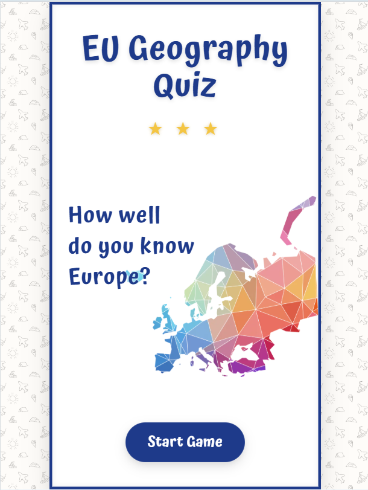 | 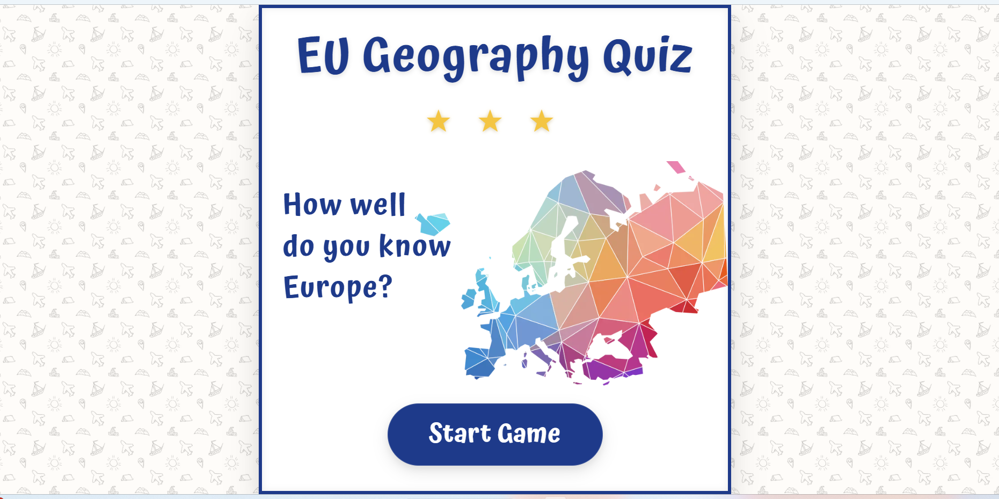 | Works as expected |
| Quiz | 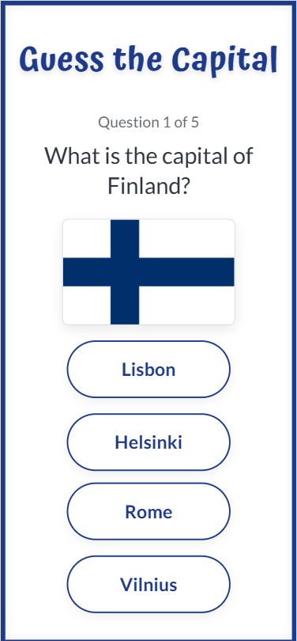 |  |  | Works as expected |
| Results | 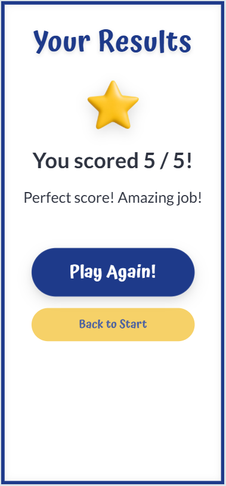 |  |  | Works as expected |
| 404 |  |  |  | Works as expected |

## Browser Compatibility

I've tested my deployed project on multiple browsers to check for compatibility issues.

| Page | Chrome | Firefox | Edge | Notes |
| --- | --- | --- | --- | --- |
| Start |  |  |  | Works as expected |
| Quiz | 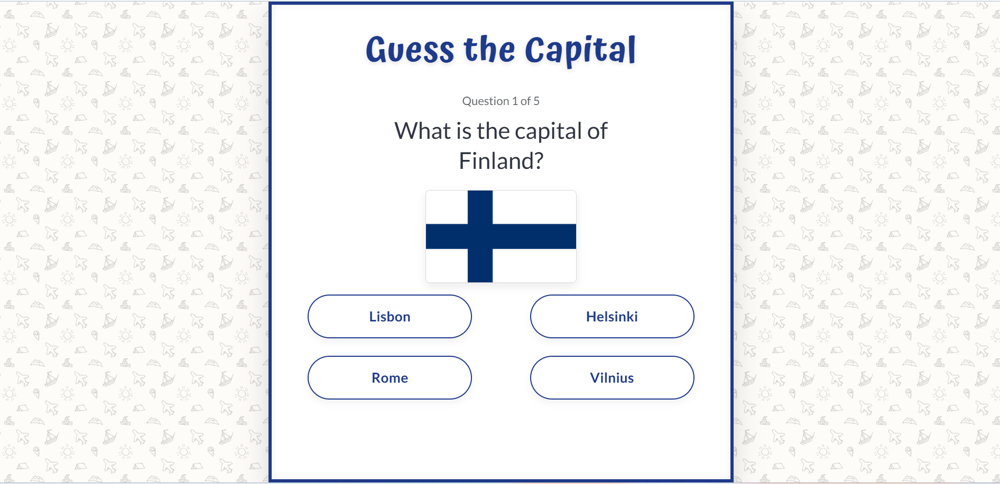 |  |  | Works as expected |
| Results |  |  |  | Works as expected |
| 404 | 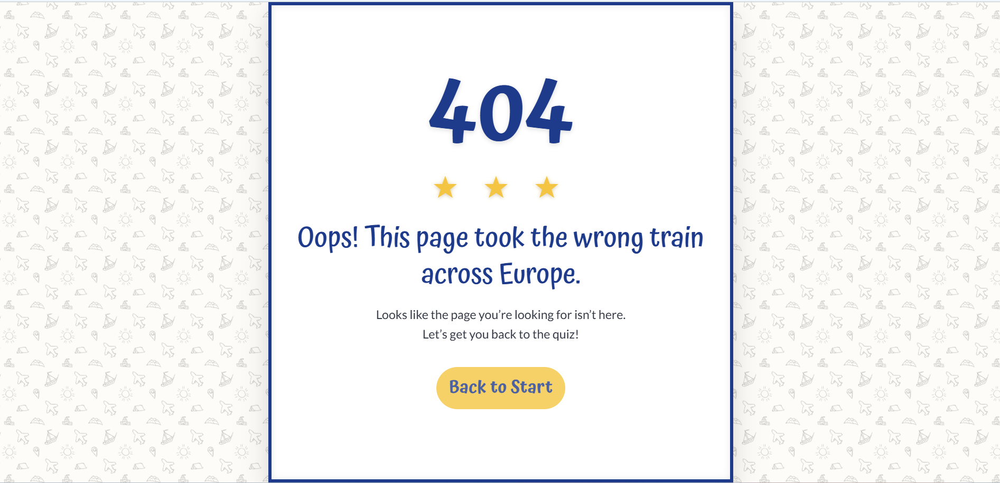 |  |  | Works as expected |

## Lighthouse Audit

I've tested my deployed project using the Lighthouse Audit tool to check for any major issues. Some warnings are outside of my control, and mobile results tend to be lower than desktop.

| Page | Mobile | Desktop |
| --- | --- | --- |
| Start |  |  |
| Quiz |  |  |
| Results |  |  |
| 404 |  |  |

## Contrast Testing

Color contrast was tested using the [WebAim Contrast Checker](https://webaim.org/resources/contrastchecker/).

The following combinations were tested:
- Body text (#2f3441) on background (#fdf8f6)
- Primary color (#1e3a8a) on white
- Button text and background combinations

All tested combinations meet WCAG AA accessibility standards.

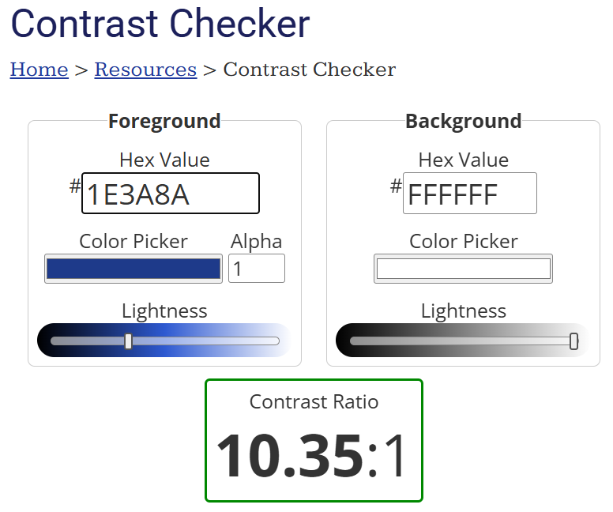

## Defensive Programming

Defensive programming measures were validated through the following manual testing scenarios.
The following test cases reference the screenshots listed in the Screenshot Evidence section below.

| Page/Feature | Expectation | Test | Result | Screenshot |
| --- | --- | --- | --- | --- |
| Welcome page / game setup | The quiz should only start with valid game settings. | Open the modal, leave the default selections unchanged, and start the game. Repeat with each valid mode and question count. | Pass – the game starts correctly with valid stored settings, preventing an undefined start state. | Screenshot 2 |
| Quiz page / stored settings validation | The quiz page should only load when valid mode and question count values exist in storage. | Start a game normally and verify that the correct mode and question count are loaded on the quiz page. | Pass – quiz settings are loaded correctly and only valid values are accepted. | Screenshot 1 |
| Quiz page / one answer per question | Each question should only be processed once. | Click one answer, then try clicking other answers again during the same question. | Pass – only the first click is accepted and no additional answer is processed. | Screenshot 1 |
| Quiz page / score protection | The score should never increase more than once for the same question. | Select an answer and attempt repeated or rapid extra clicks on answer buttons. | Pass – score is only updated once because the question is locked after the first answer. | Screenshot 1 |
| Quiz page / question state reset | After moving to the next question, the answer lock should reset so the new question can be answered normally. | Answer one question, wait for the next question to load, then answer again. | Pass – each new question accepts one answer normally, showing that the answer state resets correctly between rounds. | Screenshot 1 |
| Quiz page / browser Back button during quiz | Using the browser Back button during an active quiz should return the user to a safe state. | Start a quiz, answer one or more questions, then press the browser Back button. | Pass – the user is returned to the homepage, preventing continuation in an unsafe or broken quiz state. | Screenshot 2 |
| Results page / browser Back button after completion | Using browser history after finishing the quiz should not restore an old answered question or allow score manipulation. | Complete a quiz, reach the results page, then press the browser Back button. | Pass – the app starts a fresh quiz instead of allowing access to a previously answered question, so completed answers and scores cannot be changed. | Screenshot 3 |
| Quiz page / refresh during active game | Refreshing the quiz page should not preserve a broken or stale question state. | Start a quiz, answer a few questions, then refresh the page. | Pass – the quiz reloads safely as a new game, preventing reuse of stale progress. | Screenshot 1 |
| Results page / refresh after completion | Refreshing the results page should preserve valid results without breaking the page. | Complete a quiz, reach the results page, then refresh the browser. | Pass – the results remain valid and display the stored score correctly. | Screenshot 3 |
| Results page / stored result validation | The results page should only display sensible score data. | Finish a game and verify that the displayed score matches the total number of questions and remains within a valid range. | Pass – the results page displays valid stored results only, preventing broken or manipulated result states. | Screenshot 3 | 
| Deployed site / cross-device testing | Defensive safeguards should work consistently outside the local development environment. | Test the deployed site on another device or browser and repeat Back button and refresh checks. | Pass – defensive features behave consistently across devices and browsers. | Screenshot 1 |
| Results page / data validation | Results should only display valid score data. | Attempt to load results page with invalid or missing stored values. | Pass – invalid or missing data triggers a redirect, preventing broken or manipulated results from being displayed. | Screenshot 3 |
| Quiz logic / country selection | A country should not appear more than once per game. | Play through a full quiz and observe country repetition. | Pass – previously used countries are tracked and excluded, preventing duplicates. | Screenshot 5 |
| Quiz logic / answer generation | Each question should display unique answer options. | Check multiple questions for repeated answer choices. | Pass – wrong answers are filtered to ensure unique options. | Screenshot 1 |
| 404 Error Page | The application should display a 404 error page for non-existent routes. | Navigated to an invalid URL (e.g., `/test`) to test error handling. | A custom 404 error page was displayed as expected. | Screenshot 4 |

Some behaviors (such as repeated gameplay, refresh handling, and browser navigation) were verified through repeated manual testing and cannot always be fully represented in a single screenshot.

## User Story Testing

The following user stories reference the same screenshots listed in the Screenshot Evidence section below.

| Target | Expectation | Outcome | Screenshot |
| --- | --- | --- | --- |
| As a player | I want to choose the type of quiz (guess the country from the flag or guess the capital) | so that I can play the type of challenge I prefer. | Screenshot 2 |
| As a player | I want to choose how many questions the quiz contains | so that I can play a short or longer game depending on my schedule. | Screenshot 2 |
| As a player | I want a clear way to start the quiz after choosing my settings | so that the game begins with the options I selected. | Screenshot 2 |
| As a player | I want each quiz to display clear visual information (such as a flag or country name) | so that I can answer the question. | Screenshot 1 |
| As a player | I want to select one answer option for each question | so that I can submit my response. | Screenshot 1 |
| As a player | I want to know immediately whether my answer is correct or incorrect | so that I can improve my knowledge while playing. | Screenshot 6 |
| As a player | I want to move to the next question after answering | so that I can continue the game smoothly. | Screenshot 1 |
| As a player | I want to see my final score at the end of the quiz | so that I know how well I performed. | Screenshot 3 |
| As a player | I want to easily start a new quiz after finishing one | so that I can try to improve my score. | Screenshot 3 |
| As a player | I want the purpose of the game and how to play to be immediately clear | so that I can start playing without confusion. | Screenshot 2 |
| As a player | I want buttons that are large and easy to tap | so that I can comfortably play the game on a phone or tablet. | Screenshot 1 |
| As a player | I want sufficient color contrast in the interface | so that I can read the content and understand feedback clearly. | Screenshot 6 |
| As a player | I want a helpful error page with a way back to the homepage | so that I can continue using the site. | Screenshot 4 |

### Screenshot Evidence

**Screenshot 1 – Quiz interface (question with answer options, reused across multiple test cases)**  

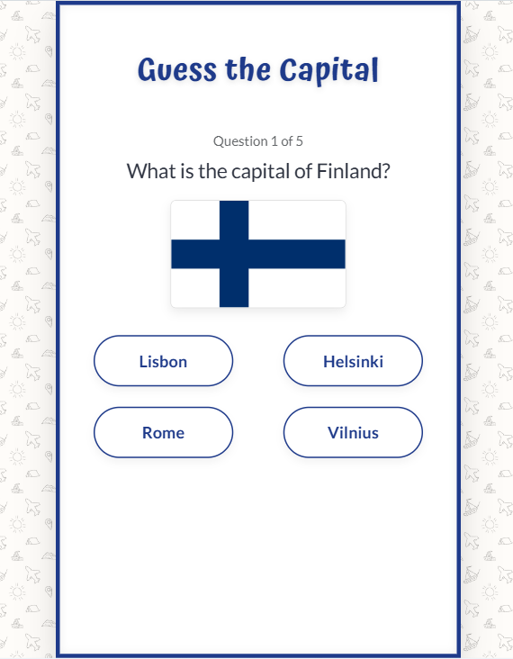

**Screenshot 2 – Game setup modal with default selections**  

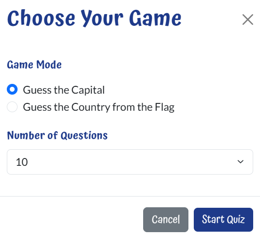

**Screenshot 3 – Results page**  

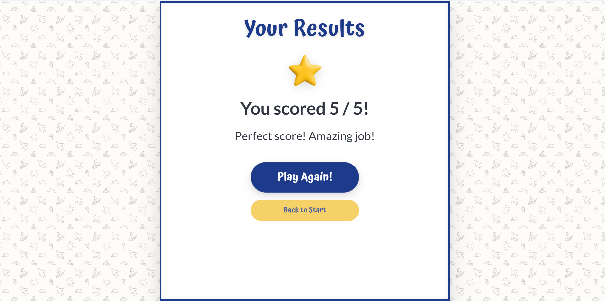

**Screenshot 4 – 404 error page** 

**Screenshot 5 – Unique answers example**  

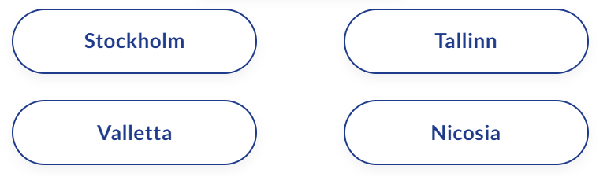

**Screenshot 6 – Answer feedback (correct/incorrect state)**  

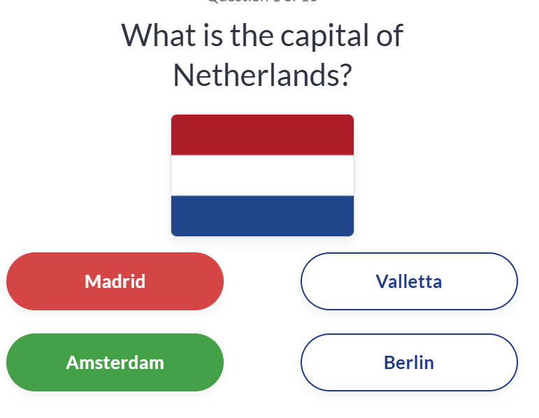

## Bugs

### Fixed Bugs

I've used [GitHub Issues](https://www.github.com/angela64711/second-milestone-project/issues) to track and manage bugs and issues during the development stages of my project.

All previously closed/fixed bugs can be tracked [here](https://www.github.com/angela64711/second-milestone-project/issues?q=is%3Aissue+is%3Aclosed+label%3Abug).

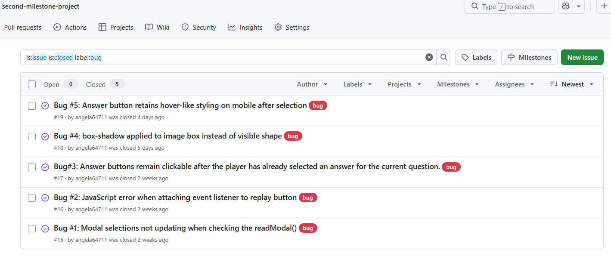

### Unfixed Bugs

All identified issues were resolved prior to project submission, resulting in zero open issues in GitHub. 

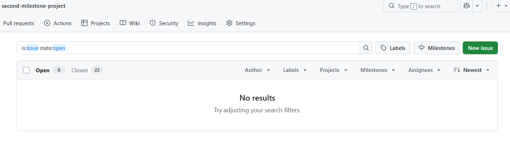

### Known Issues

 There are no remaining bugs that I am aware of, though, even after thorough testing, I cannot rule out the possibility.

