# Testing

> [!NOTE]  
> Return back to the [README.md](README.md) file.

## Code Validation

### HTML

I have used the recommended [HTML W3C Validator](https://validator.w3.org) to validate all of my HTML files.

| Directory | File | URL | Screenshot | Notes |
| --- | --- | --- | --- | --- |
|  | [404.html](https://github.com/angela64711/second-milestone-project/blob/main/404.html) | [HTML Validator](https://validator.w3.org/nu/?doc=https://angela64711.github.io/second-milestone-project/404.html) | 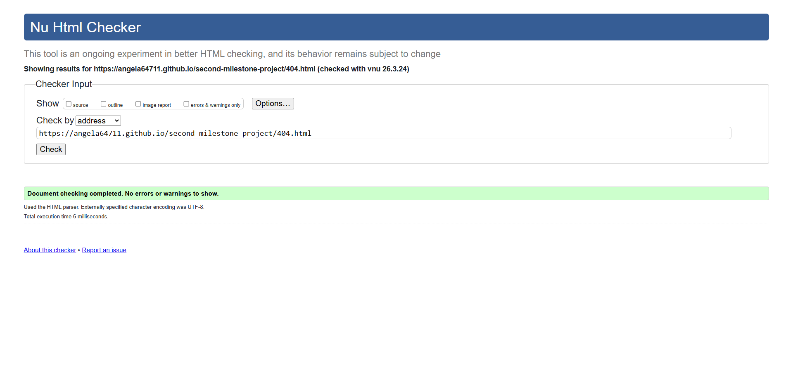 | 
|  | [index.html](https://github.com/angela64711/second-milestone-project/blob/main/index.html) | [HTML Validator](https://validator.w3.org/nu/?doc=https://angela64711.github.io/second-milestone-project/index.html) |  | 
|  | [quiz.html](https://github.com/angela64711/second-milestone-project/blob/main/quiz.html) | [HTML Validator](https://validator.w3.org/nu/?doc=https://angela64711.github.io/second-milestone-project/quiz.html) | 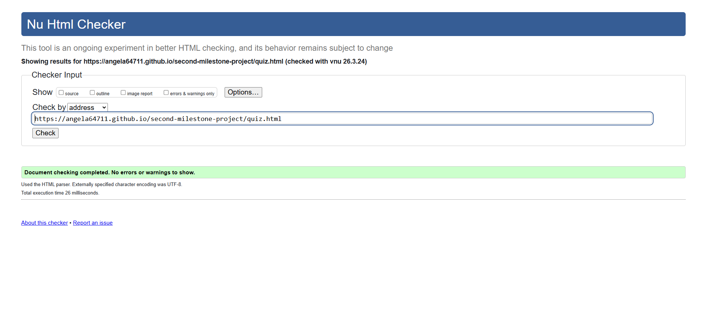 | 
|  | [results.html](https://github.com/angela64711/second-milestone-project/blob/main/results.html) | [HTML Validator](https://validator.w3.org/nu/?doc=https://angela64711.github.io/second-milestone-project/results.html) | 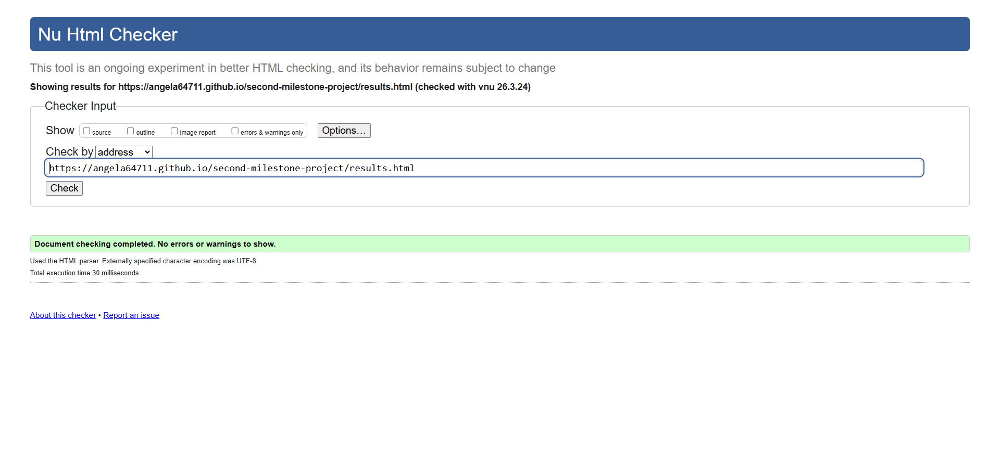 | 

### CSS

I have used the recommended [CSS Jigsaw Validator](https://jigsaw.w3.org/css-validator) to validate all of my CSS files.

| Directory | File | URL | Screenshot | Notes |
| --- | --- | --- | --- | --- |
| assets | [style.css](https://github.com/angela64711/second-milestone-project/blob/main/assets/css/style.css) | [CSS Validator](https://jigsaw.w3.org/css-validator/validator?uri=https://angela64711.github.io/second-milestone-project) | 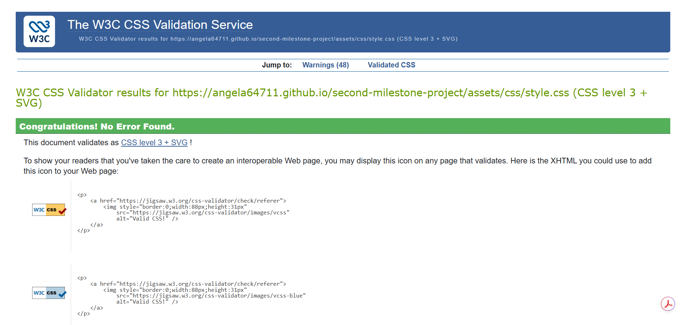 | ⚠️ Notes (if applicable) |

### JavaScript

⚠️ INSTRUCTIONS ⚠️

If using modern JavaScript (ES6) methods, then make sure to include the following line at the very top of every single JavaScript file in your project (this should remain in your files for submission as well):

`/* jshint esversion: 11 */`

If you are also including jQuery (`$`), then the updated format will be:

`/* jshint esversion: 11, jquery: true */`

This allows the JShint validator to recognize modern ES6 methods, such as: `let`, `const`, `template literals`, `arrow functions (=>)`, etc.

**IMPORTANT**: External resources

Sometimes we'll write JavaScript that imports variables from other files, such as "an array of questions" from `questions.js`, which are used within the main `script.js` file elsewhere. If that's the case, the JShint validation tool doesn't know how to recognize "unused variables" that would normally be imported locally when running your own project. These warnings are acceptable, so showcase on your screenshot(s).

The same thing applies when using external libraries such as Stripe, Leaflet, Bootstrap, Materialize, etc. To instantiate these components, we need to use their respective declarator. Again, the JShint validation tool would flag these as "undefined/unused variables". These warnings are acceptable, so showcase on your screenshot(s).

⚠️ --- END --- ⚠️

I have used the recommended [JShint Validator](https://jshint.com) to validate all of my JS files.

| Directory | File | URL | Screenshot | Notes |
| --- | --- | --- | --- | --- |
| assets | [country-data.js](https://github.com/angela64711/second-milestone-project/blob/main/assets/js/country-data.js) |  | 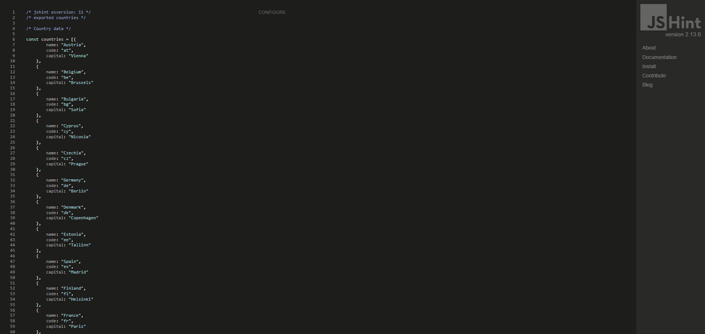 | ⚠️ Notes (if applicable) |
| assets | [script.js](https://github.com/angela64711/second-milestone-project/blob/main/assets/js/script.js) |  | 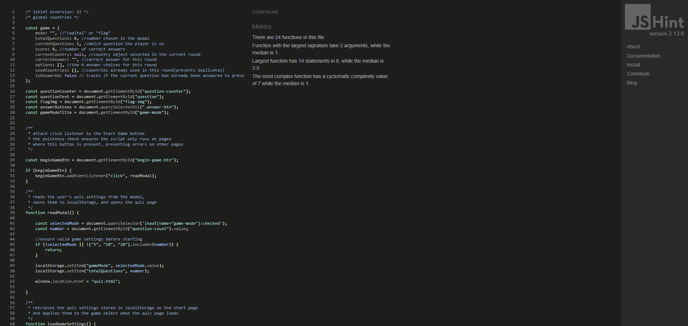 | ⚠️ Notes (if applicable) |

## Responsiveness

I've tested my deployed project to check for responsiveness issues.

| Page | Mobile | Tablet | Desktop | Notes |
| --- | --- | --- | --- | --- |
| Home |  |  |  | Works as expected |
| Game |  |  |  | Works as expected |
| 404 | 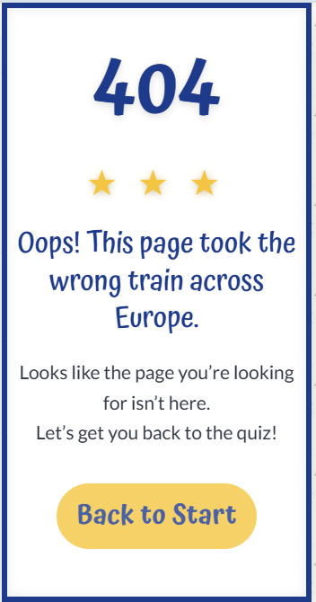 | 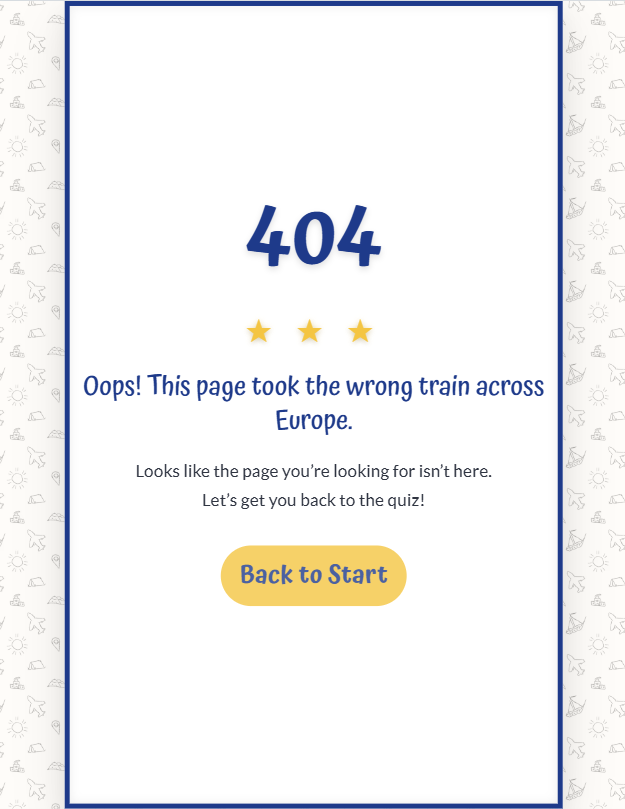 |  | Works as expected |

## Browser Compatibility

I've tested my deployed project on multiple browsers to check for compatibility issues.

| Page | Chrome | Firefox | Edge | Notes |
| --- | --- | --- | --- | --- |
| Home |  |  |  | Works as expected |
| Game |  |  |  | Works as expected |
| 404 |  |  |  | Works as expected |

## Lighthouse Audit

⚠️ INSTRUCTIONS ⚠️

Use this space to discuss testing the live/deployed site's Lighthouse Audit reports. Avoid testing the local version (Gitpod/VSCode/etc.), as this can have knock-on effects for performance. If you don't have "Lighthouse" in your Developer Tools, it can be added as an [extension](https://chrome.google.com/webstore/detail/lighthouse/blipmdconlkpinefehnmjammfjpmpbjk).

Unless your project is a single-page application (SPA), you should test Lighthouse Audit results for all of your pages, for both *mobile* and *desktop*.

**IMPORTANT**: You must provide screenshots of the results, to "prove" that you've actually tested them.

⚠️ --- END --- ⚠️

I've tested my deployed project using the Lighthouse Audit tool to check for any major issues. Some warnings are outside of my control, and mobile results tend to be lower than desktop.

| Page | Mobile | Desktop |
| --- | --- | --- |
| Start | 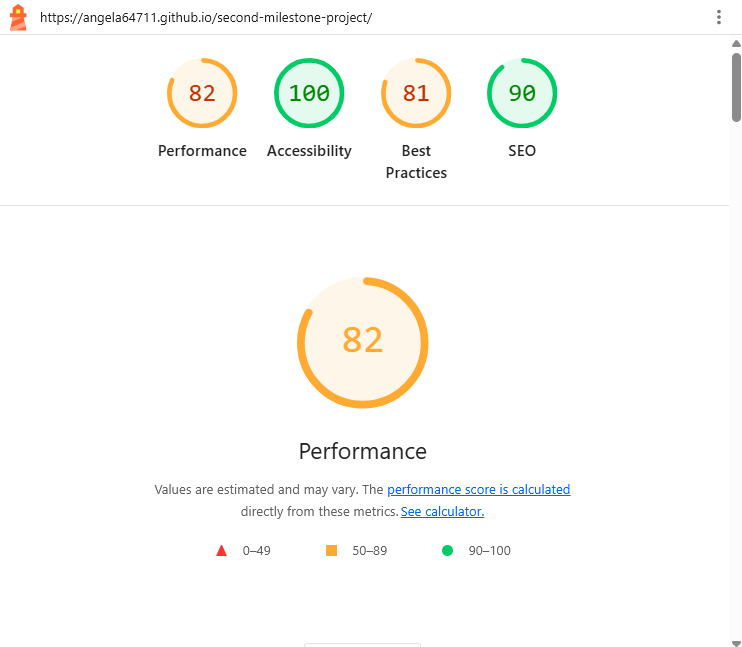 | 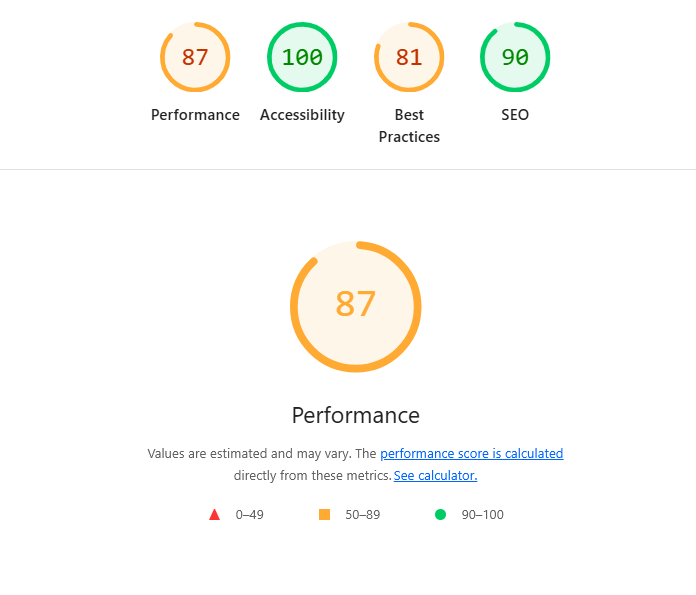 |
| Quiz | 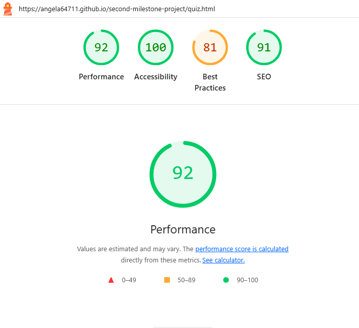 | 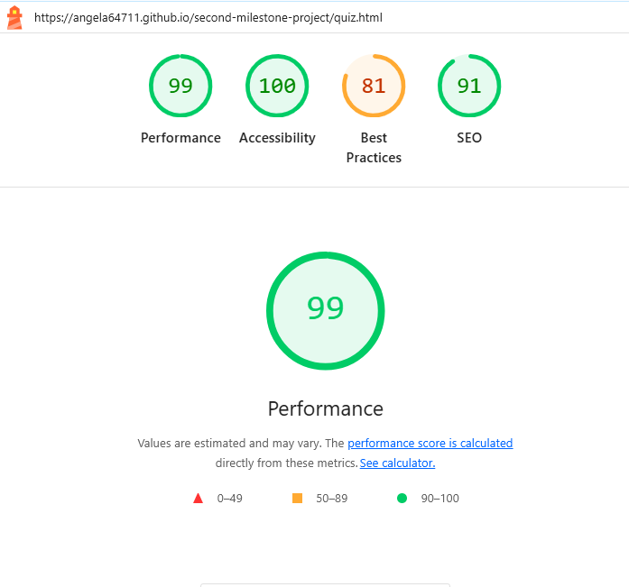 |
| Results | 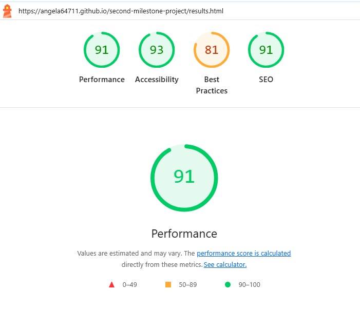 | 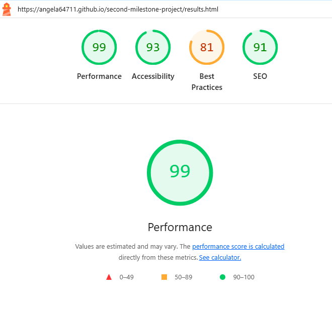 |
| 404 | 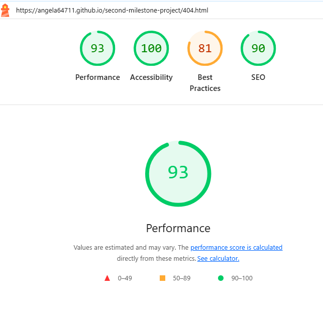 | 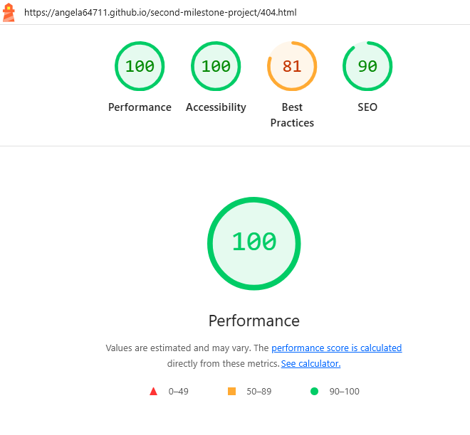 |

## Defensive Programming

⚠️ INSTRUCTIONS ⚠️

Defensive programming (defensive design) is extremely important! When building projects that accept user inputs or forms, you should always test the level of security for each form field. Examples of this could include (but not limited to):

All Projects:

- Users cannot submit an empty form (add the `required` attribute)
- Users must enter valid field types (ensure the correct input `type=""` is used)
- Users cannot brute-force a URL to navigate to a restricted pages

Testing should be replicable (can someone else replicate the same outcome?). Ideally, tests cases should focus on each individual section of every page on the website. Each test case should be specific, objective, and step-wise replicable.

Instead of adding a general overview saying that everything works fine, consider documenting tests on each element of the page (eg. button clicks, input box validation, navigation links, etc.) by testing them in their "happy flow", their "bad/exception flow", mentioning the expected and observed results, and drawing a parallel between them where applicable.

Consider using the following format for manual test cases:

- Expected Outcome / Test Performed / Result Received / Fixes Implemented

- **Expected**: "Feature is expected to do X when the user does Y."
- **Testing**: "Tested the feature by doing Y."
- (either) **Result**: "The feature behaved as expected, and it did Y."
- (or) **Result**: "The feature did not respond to A, B, or C."
- **Fix**: "I did Z to the code because something was missing."

Use the table below as a basic start, and expand on it using the logic above.

⚠️ --- END --- ⚠️

Defensive programming was manually tested with the below user acceptance testing:

| Page/Feature | Expectation | Test | Result | Screenshot |
| --- | --- | --- | --- | --- |
| Calculator UI | Feature is expected to allow the user to input two numbers and select an operator (`+`, `-`, `*`, `/`). | Entered two numbers and selected each operator to perform calculations. | Calculations for all operators worked as expected. |  |
| | Feature is expected to show an error message if inputs are empty (`NaN`). | Tried submitting calculations with empty input fields. | Error message displayed as expected. |  |
| | Feature is expected to display buttons that are clear, large, and easy to select on all devices. | Verified button sizes and usability across multiple devices (mobile, tablet, desktop). | Buttons were accessible and easy to use on all tested devices. |  |
| | Feature is expected to use high-contrast colors and accessible fonts. | Checked contrast ratios using accessibility tools (e.g., Lighthouse, Wave). | Colors and fonts met accessibility standards. |  |
| | Feature is expected to have clear labels and instructions for user guidance. | Reviewed labels and instructions for clarity and ease of use. | Labels and instructions were clear and intuitive. |  |
| Instant Calculation | Feature is expected to calculate and display results instantly after selecting an operator. | Selected operators after entering two numbers. | Results were displayed instantly. |  |
| Error Handling | Feature is expected to display correct results even if an equation was input incorrectly. | Entered various incorrect equations and verified the results. | Correct results were displayed for all tested cases. |  |
| Score Tracker | Feature is expected to track the number of correct and incorrect equations. | Performed multiple calculations (correct and incorrect) and checked the score tracker. | Score tracker updated correctly for all tested scenarios. |  |
| 404 Error Page | Feature is expected to display a 404 error page for non-existent pages. | Navigated to an invalid URL (e.g., `/test`) to test error handling. | A custom 404 error page was displayed as expected. | 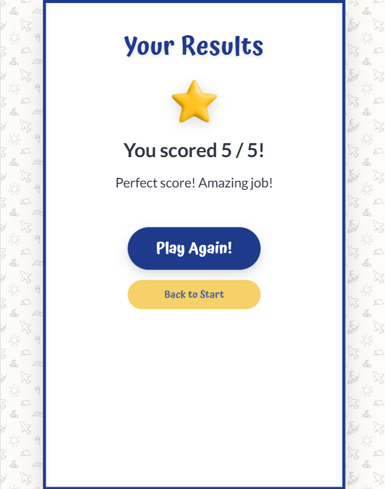 |

## User Story Testing

⚠️ INSTRUCTIONS ⚠️

Testing User Stories is actually quite simple, once you've already got the stories defined on your README.

Most of your project's **Features** should already align with the **User Stories**, so this should be as simple as creating a table with the User Story, matching with the re-used screenshot from the respective Feature.

⚠️ --- END --- ⚠️

| Target | Expectation | Outcome | Screenshot |
| --- | --- | --- |
| As a player | I want to choose the type of quiz (guess the country from the flag or guess the capital) | so that I can play the type of challenge I prefer. |  |
| As a player | I want to choose how many questions the quiz contains | so that I can play a short or longer game depending on my schedule. |  |
| As a player | I want a clear way to start the quiz after choosing my settings | so that the game begins with the options I selected. |  |
| As a player | I want each quiz to display clear visual information (such as a flag or country name) | so that I can answer the question. |  |
| As a player | I want to select one answer option for each question | so that I can submit my response. |  |
| As a player | I wan to know immediatelly whether my answer is correct or incorrect | so that I can improve my knowledge while playing. |  |
| As a player | I want to move to the next question after answering | so that I can continue the game smoothly. |  |
| As a player | I want to see my final score at the end of the quiz | so that I know how well I performed. |  |
| As a player | I want to easily start a new quiz after finishing one | so that I can try to improve my score. |  |
| As a player | I want the purpose of the game and how to play to be immediately clear | so that I can start playing without confusion. |  |
| As a player | I want buttons that are large and easy to tap | so that I can comfortably play the game on a phone or tablet. |  |
| As a player | I want sufficient color contrast in the interface | so that I can read the content and understand feedback clearly. |  |
| As a player | I want a helpful error page with a way back to the homepage | so that I can continue using the site. |  |

## Bugs

⚠️ INSTRUCTIONS ⚠️

Nobody likes bugs,... except the assessors! Projects seem more suspicious if a student doesn't properly track their bugs. If you're about to submit your project without any bugs listed below, you should ask yourself why you're doing this course in the first place, if you're able to build this entire application without running into any bugs. The best thing you can do for any project is to document your bugs! Not only does it show the true stages of development, but think of it as breadcrumbs for yourself in the future, should you encounter the same/similar bug again, it acts as a gentle reminder on what you did to fix the bug.

If/when you encounter bugs during the development stages of your project, you should document them here, ideally with a screenshot explaining what the issue was, and what you did to fix the bug.

Alternatively, an improved way to manage bugs is to use the built-in **[Issues](https://www.github.com/angela64711/second-milestone-project/issues)** tracker on your GitHub repository. This can be found at the top of your repository, the tab called "Issues".

If using the Issues tracker for bug management, you can simplify the documentation process for testing. Issues allow you to directly paste screenshots into the issue page without having to first save the screenshot locally. You can add labels to your issues (e.g. `bug`), assign yourself as the owner, and add comments/updates as you progress with fixing the issue(s). Once you've solved the issue/bug, you should then "Close" it.

When showcasing your bug tracking for assessment, you can use the following examples below.

⚠️ --- END --- ⚠️

### Fixed Bugs

I've used [GitHub Issues](https://www.github.com/angela64711/second-milestone-project/issues) to track and manage bugs and issues during the development stages of my project.

All previously closed/fixed bugs can be tracked [here](https://www.github.com/angela64711/second-milestone-project/issues?q=is%3Aissue+is%3Aclosed+label%3Abug).

### Unfixed Bugs

⚠️ INSTRUCTIONS ⚠️

You will need to mention any unfixed bugs and why they are not fixed upon submission of your project. This section should include shortcomings of the frameworks or technologies used. Although time can be a big variable to consider, paucity of time and difficulty understanding implementation is not a valid reason to leave bugs unfixed. Where possible, you must fix all outstanding bugs, unless outside of your control.

If you've identified any unfixed bugs, no matter how small, be sure to list them here! It's better to be honest and list them, because if it's not documented and an assessor finds the issue, they need to know whether or not you're aware of them as well, and why you've not corrected/fixed them.

⚠️ --- END --- ⚠️/* jshint esversion: 11 */
/* global countries */

const game = {
    mode: "", //"capital" or "flag"
    totalQuestions: 0, //number chosen in the modal
    currentQuestion: 1, //which question the player is on
    score: 0, //number of correct answers
    currentCountry: null, //country object selected in the current round
    correctAnswer: "", //correct answer for this round
    options: [], //the 4 answer choices for this round
    usedCountries: [] //countries already used in this round(prevents duplicates)
};

const questionCounter = document.getElementById("question-counter");
const questionText = document.getElementById("question");
const flagImg = document.getElementById("flag-img");
const answerButtons = document.querySelectorAll(".answer-btn");
const gameModeTitle = document.getElementById("game-mode");

/**
 * attach click listener to the Start Game button
 * the existence check ensures the script only runs on pages
 * where this button is present, preventing errors on other pages
 */

let beginGameBtn = document.getElementById("begin-game-btn");

if (beginGameBtn) {
    beginGameBtn.addEventListener("click", readModal);
}

/**
 * reads the user's quiz settings from the modal,
 * saves them to localStorage, and opens the quiz page
 */
function readModal() {

    let mode = document.querySelector('input[name="game-mode"]:checked').value;
    let number = document.getElementById("question-count").value;

    localStorage.setItem("gameMode", mode);
    localStorage.setItem("totalQuestions", number);

    window.location.href = "quiz.html";

}

/**
 * retrieves the quiz settings stored in localStorage on the start page
 * and applies them to the game object when the quiz page loads
 */
function loadGameSettings() {
    game.mode = localStorage.getItem("gameMode");
    game.totalQuestions = Number(localStorage.getItem("totalQuestions"));

    // prevent loading the quiz page without valid game settings
    if (!game.mode || !game.totalQuestions) {
        window.location.href = "index.html";
    }
}

/**
 * start the game only if the quiz page elements exist
 * prevents the game logic from running on other pages like index.html
 */

if (questionCounter) {

    loadGameSettings();

    answerButtons.forEach(button => {
        button.addEventListener("click", checkAnswer);
    });

    startGame();
}

/**
 * initializes and resets the game state
 * calls the appropriate display*Question()
 */
function startGame() {

    // Reset game state
    game.currentQuestion = 1;
    game.score = 0;
    game.currentCountry = null;
    game.correctAnswer = "";
    game.options = [];
    game.usedCountries = [];

    // Update the quiz title and display first question depending on the selected mode
    if (game.mode === "capital") {
        gameModeTitle.innerText = "Guess the Capital";
        displayCapitalQuestion();
    } else if (game.mode === "flag") {
        gameModeTitle.innerText = "Guess the Country from the Flag";
        displayFlagQuestion();
    }
}

/**
 * prepares the round (choose valid country and 3 wrong ones, shuffle, push to buttons)
 * sets game.currentCountry, game.correctAnswer, game.options
 * updates game.usedCountries (add current country)
 * displays question and answers
 * waits for user click
 * user click triggers checkAnswer()
 */
function displayCapitalQuestion() {

    const selectedCountry = getUnusedCountry();
    const wrongAnswers = getWrongCapitals(selectedCountry);

    game.currentCountry = selectedCountry;
    game.correctAnswer = selectedCountry.capital;

    let options = [...wrongAnswers];
    const randomPosition = Math.floor(Math.random() * 4);
    options.splice(randomPosition, 0, selectedCountry.capital);

    game.options = options;
    game.usedCountries.push(selectedCountry.name);

    questionCounter.innerText = `Question ${game.currentQuestion} of ${game.totalQuestions}`;
    questionText.innerText = `What is the capital of ${game.currentCountry.name}?`;
    flagImg.src = `assets/images/flags/${game.currentCountry.code}.png`;
    flagImg.alt = `Flag of ${game.currentCountry.name}`;

    answerButtons.forEach((button, index) => {
        button.innerText = game.options[index];
    });

}

/**
 * prepares the round (choose valid country and 3 wrong ones, shuffle, push to buttons)
 * sets game.currentCountry, game.correctAnswer, game.options
 * updates game.usedCountries (add current country)
 * displays question and answers
 * waits for user click
 * user click triggers checkAnswer()
 */
function displayFlagQuestion() {

    const selectedCountry = getUnusedCountry();
    const wrongAnswers = getWrongCountryNames(selectedCountry);

    game.currentCountry = selectedCountry;
    game.correctAnswer = selectedCountry.name;

    let options = [...wrongAnswers];
    const randomPosition = Math.floor(Math.random() * 4);
    options.splice(randomPosition, 0, selectedCountry.name);

    game.options = options;
    game.usedCountries.push(selectedCountry.name);

    questionCounter.innerText = `Question ${game.currentQuestion} of ${game.totalQuestions}`;
    questionText.innerText = "Which country does this flag belong to?";
    flagImg.src = `assets/images/flags/${game.currentCountry.code}.png`;
    flagImg.alt = `Flag of ${game.currentCountry.name}`;

    answerButtons.forEach((button, index) => {
        button.innerText = game.options[index];
    });

}

/**
 * selects a random country that has not been used in the current game
 * filters out already used countries and returns one random country
 */

function getUnusedCountry() {

    // create an array containing only countries that have not been used
    const unusedCountries = countries.filter(country => !game.usedCountries.includes(country.name));

    // generate a random index within the range of the  unusedCountries array
    const randomIndex = Math.floor(Math.random() * unusedCountries.length);

    //return the country at that random position
    return unusedCountries[randomIndex];

}

/**
 * returns three wrong capital answers for the current question
 * excludes the correct country and randomly selects three different capitals
 */

function getWrongCapitals(correctCountry) {

    // create an array of countries excluding the correct one
    const wrongCountries = countries.filter(country =>
        country.name !== correctCountry.name
    );

    const wrongCapitals = [];

    while (wrongCapitals.length < 3) {
        const randomIndex = Math.floor(Math.random() * wrongCountries.length);
        const randomCapital = wrongCountries[randomIndex].capital;

        if (!wrongCapitals.includes(randomCapital)) {
            wrongCapitals.push(randomCapital);
        }
    }

    return wrongCapitals;
}

/**
 * returns three wrong country names for the current question
 * excludes the correct country and randomly selects three different country names
 */

function getWrongCountryNames(correctCountry) {
    const wrongCountries = countries.filter(country =>
        country.name !== correctCountry.name
    );

    const wrongCountryNames = [];

    while (wrongCountryNames.length < 3) {
        const randomIndex = Math.floor(Math.random() * wrongCountries.length);
        const randomCountryName = wrongCountries[randomIndex].name;

        if (!wrongCountryNames.includes(randomCountryName)) {
            wrongCountryNames.push(randomCountryName);
        }
    }

    return wrongCountryNames;
}

/**
 * triggered when the user clicks an answer button
 * compares the selected answer with the correct answer stored in the game object
 * calls the visual feedback function to highlight the answers
 * updates the score if the answer is correct
 * waits briefly before advancing to the next question
 */
function checkAnswer(event) {

    const clickedButton = event.target; //refers to the element that was clicked
    const selectedAnswer = clickedButton.innerText;
    const isCorrect = selectedAnswer === game.correctAnswer; // true if the clicked answer matches the correct answer stored in the game object

    lightsOn(clickedButton);

    // disable all answer buttons after the first selection to prevent multiple answers per question
    answerButtons.forEach(button => {
        button.disabled = true;
    });

    if (isCorrect) {
        updateScore();
    }

    setTimeout(advanceGame, 1300); // delay advancing to the next question so the player can see the feedback
}

/**
 * displays visual feedback after an answer is selected
 * highlights the correct answer in green
 * if the player selected the wrong answer, highlights the clicked button in red
 */
function lightsOn(clickedButton) {

    answerButtons.forEach(button => {

        if (button.innerText === game.correctAnswer) {
            button.classList.add("correct");
        }

    });

    if (clickedButton.innerText !== game.correctAnswer) {
        clickedButton.classList.add("wrong");
    }

}

/**
 * increases the player's score by one when a correct answer is selected
 * updates the score stored in the game state
 */
function updateScore() {

    game.score += 1;

}

/**
 * progresses the game after each question
 * resets button styles and re-enables the answer buttons
 * increments the question counter
 * loads the next question or ends the game when all questions are answered
 */
function advanceGame() {

    // reset button state for the next question
    answerButtons.forEach(button => {
        button.classList.remove("correct", "wrong");
        button.disabled = false;

    });

    game.currentQuestion += 1;

    if (game.currentQuestion <= game.totalQuestions) {
        if (game.mode === "capital") {
            displayCapitalQuestion();
        } else if (game.mode === "flag") {
            displayFlagQuestion();
        }
    } else {
        endGame();
    }

}

/**
 * ends the game when all questions have been answered
 * stores the final score and total number of questions in localStorage
 * redirects the player to the results page
 */
function endGame() {

    localStorage.setItem("finalScore", game.score);
    localStorage.setItem("finalTotalQuestions", game.totalQuestions);

    window.location.href = "results.html";

}

const resultText = document.getElementById("score");
const resultMessage = document.getElementById("message");

/**
 * runs only on the results page
 * retrieves the stored score from localStorage
 * displays the final score and a message to the player
 */
if (resultText) {
    displayResult();
}

function displayResult() {

    const finalScore = Number(localStorage.getItem("finalScore"));
    const totalQuestions = Number(localStorage.getItem("finalTotalQuestions"));

    resultText.innerText = `You scored ${finalScore} / ${totalQuestions}!`;

    if (finalScore === totalQuestions) {
        resultMessage.innerText = "Perfect score! Amazing job!";
    } else if (finalScore >= totalQuestions / 2) {
        resultMessage.innerText = "Great job!";
    } else {
        resultMessage.innerText = "Nice try! Play again and improve your score.";
    }

}

Any remaining open issues can be tracked [here](https://www.github.com/angela64711/second-milestone-project/issues?q=is%3Aissue+is%3Aopen+label%3Abug).

### Known Issues

| Issue | Screenshot |
| --- | --- |
| The project is designed to be responsive from `375px` and upwards, in line with the material taught on the course LMS. Minor layout inconsistencies may occur on extra-wide (e.g. 4k/8k monitors), or smart-display devices (e.g. Nest Hub, Smart Watches, Gameboy Color, etc.), as these resolutions are outside the project’s scope, as taught by Code Institute. |  |
| When validating HTML with a semantic `<section>` element, the validator warns about lacking a header `h2-h6`. This is acceptable. |  |

> [!IMPORTANT]  
> There are no remaining bugs that I am aware of, though, even after thorough testing, I cannot rule out the possibility.

